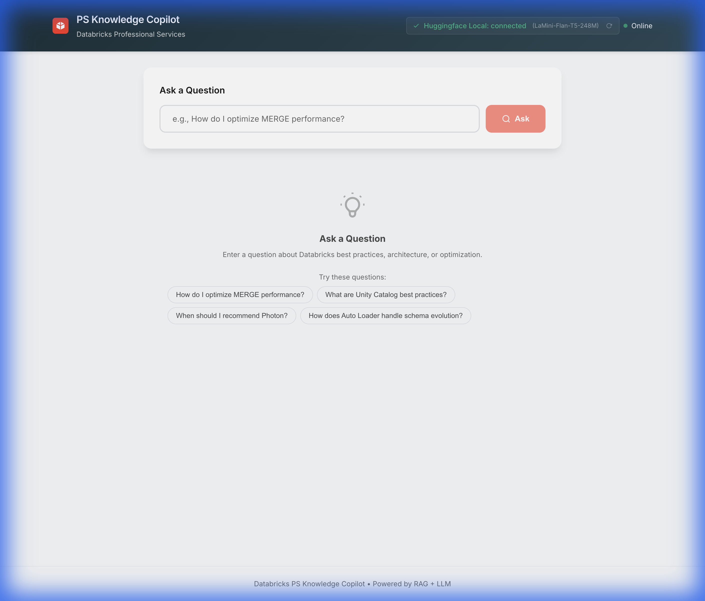

# 🧠 Databricks PS Knowledge Copilot

An internal AI "Knowledge Assistant" for Databricks Professional Services (PS) teams. This tool ingests technical documentation and provides instant, accurate answers to complex consulting questions using Retrieval-Augmented Generation (RAG).

## 📸 Screenshots

### Main Interface
The clean, modern interface allows consultants to quickly ask questions or select from common example queries. The header shows real-time API connection status.



---

### Photon Engine Query
Ask about when to recommend Photon for optimal performance. The answer includes detailed recommendations and cites source documents.


---

### Unity Catalog Best Practices
Get authoritative guidance on Unity Catalog architecture, namespace structure, and governance patterns for enterprise deployments.


---

### Auto Loader Schema Evolution
Understand how Auto Loader handles schema changes dynamically, with specific configuration recommendations from the knowledge base.


## 🚀 Features

-   **RAG Architecture**: Retrieves relevant context from ingested docs before answering.
-   **Local AI**: Uses a free, local Hugging Face model (`LaMini-Flan-T5`) for privacy and cost-efficiency.
-   **Vector Search**: Powered by ChromaDB (local) or Databricks Vector Search (cloud).
-   **Modern React UI**: Clean, responsive interface with real-time status indicators and example queries.
-   **FastAPI Backend**: High-performance async API with automatic documentation.
-   **Source Citations**: Every answer includes references to the source documents with relevance scores.

## 🛠️ Tech Stack

-   **Backend**: Python 3.11+ with FastAPI
-   **Frontend**: React 18 + Vite
-   **LLM**: Hugging Face (`MBZUAI/LaMini-Flan-T5-248M`)
-   **Vector Store**: ChromaDB
-   **Embeddings**: Sentence Transformers (`all-MiniLM-L6-v2`)

## 📦 Setup

1.  **Clone the repository**:
    ```bash
    git clone <repo-url>
    cd Databricks-PS-Knowledge-Copilot
    ```

2.  **Create Virtual Environment & Install Backend Dependencies**:
    ```bash
    python3 -m venv venv
    source venv/bin/activate
    pip install -r requirements.txt
    ```

3.  **Install Frontend Dependencies**:
    ```bash
    cd frontend
    npm install
    cd ..
    ```

4.  **Run the Backend** (Terminal 1):
    ```bash
    source venv/bin/activate
    uvicorn app.api.main:app --reload --port 8000
    ```
    
    The API will be available at `http://localhost:8000` with docs at `http://localhost:8000/api/docs`.

5.  **Run the Frontend** (Terminal 2):
    ```bash
    cd frontend
    npm run dev
    ```
    
    The app will open at `http://localhost:5173`.

## 👥 How Databricks PS Consultants Use This

This tool is designed to reduce "tribal knowledge" loss and speed up delivery.

### 1. The Data Engineer 🛠️
**Scenario**: Optimizing a slow ETL pipeline.
-   **Query**: *"How do I optimize MERGE performance?"*
-   **Result**: The Copilot suggests Z-Ordering, pruning, and Auto Optimize, citing `delta_lake_performance.md`.
-   **Benefit**: Saves hours of searching through Slack or Wiki.

### 2. The Solution Architect 🏗️
**Scenario**: Designing a governance model for a large enterprise.
-   **Query**: *"What is the best way to structure Unity Catalog?"*
-   **Result**: Recommends the 3-level namespace (`catalog.schema.table`) and segregating environments by catalog.
-   **Benefit**: Ensures architectural consistency across engagements.

### 3. The Platform Admin 🔐
**Scenario**: Planning capacity and compute types.
-   **Query**: *"When should I recommend Photon?"*
-   **Result**: Advises using Photon for BI and heavy aggregations, citing `photon_engine.md`.
-   **Benefit**: Provides authoritative, documented backing for recommendations.

## 🔄 Ingestion Workflow

To add new knowledge:
1.  Place `.md`, `.txt`, or `.ipynb` files in `data/example_inputs/`.
2.  Use the API endpoint to trigger ingestion:
    ```bash
    curl -X POST http://localhost:8000/api/ingest \
      -H "Content-Type: application/json" \
      -d '{"directory": "data/example_inputs"}'
    ```
3.  The system automatically chunks, embeds, and indexes the new content.

> **Tip**: Check `http://localhost:8000/api/stats` to see the current document count in the knowledge base.
