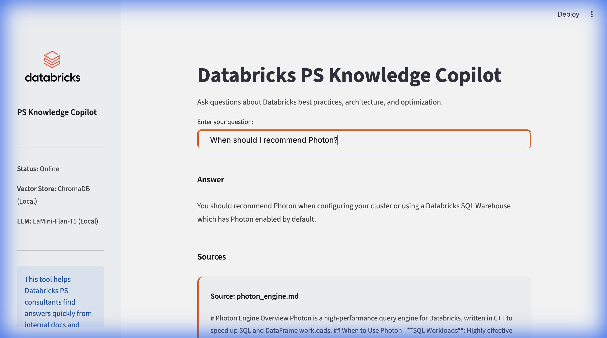
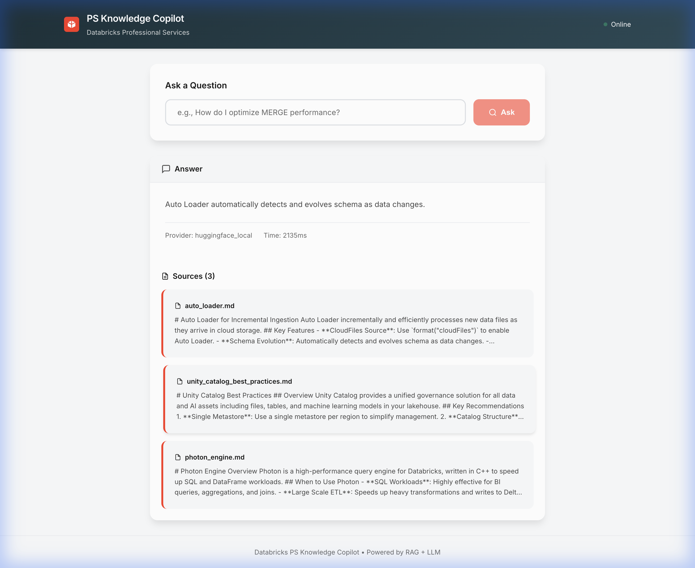

# 🧠 Databricks PS Knowledge Copilot

An internal AI "Knowledge Assistant" for Databricks Professional Services (PS) teams. This tool ingests technical documentation and provides instant, accurate answers to complex consulting questions using Retrieval-Augmented Generation (RAG).


<br>

<br>


## 🚀 Features

-   **RAG Architecture**: Retrieves relevant context from ingested docs before answering.
-   **Local AI**: Uses a free, local Hugging Face model (`LaMini-Flan-T5`) for privacy and cost-efficiency.
-   **Vector Search**: Powered by ChromaDB (local) or Databricks Vector Search (cloud).
-   **Clean UI**: Minimalist Streamlit interface designed for quick lookups.
-   **Source Citations**: Every answer includes references to the source documents.

## 🛠️ Tech Stack

-   **Language**: Python 3.11+
-   **UI**: Streamlit
-   **LLM**: Hugging Face (`MBZUAI/LaMini-Flan-T5-248M`)
-   **Vector Store**: ChromaDB
-   **Ingestion**: BeautifulSoup4, LangChain (implied via custom loader)

## 📦 Setup

1.  **Clone the repository**:
    ```bash
    git clone <repo-url>
    cd Databricks-PS-Knowledge-Copilot
    ```

2.  **Create Virtual Environment**:
    ```bash
    python3 -m venv venv
    source venv/bin/activate
    ```

3.  **Install Dependencies**:
    ```bash
    pip install -r requirements.txt
    ```

4.  **Run the App**:
    ```bash
    streamlit run app/ui/streamlit_app.py
    ```

## 👥 How Databricks PS Consultants Use This

This tool is designed to reduce "tribal knowledge" loss and speed up delivery.

### 1. The Data Engineer 🛠️
**Scenario**: Optimizing a slow ETL pipeline.
-   **Query**: *"How do I optimize MERGE performance?"*
-   **Result**: The Copilot suggests Z-Ordering, pruning, and Auto Optimize, citing `delta_lake_performance.md`.
-   **Benefit**: Saves hours of searching through Slack or Wiki.

### 2. The Solution Architect 🏗️
**Scenario**: Designing a governance model for a large enterprise.
-   **Query**: *"What is the best way to structure Unity Catalog?"*
-   **Result**: Recommends the 3-level namespace (`catalog.schema.table`) and segregating environments by catalog.
-   **Benefit**: Ensures architectural consistency across engagements.

### 3. The Platform Admin 🔐
**Scenario**: Planning capacity and compute types.
-   **Query**: *"When should I recommend Photon?"*
-   **Result**: Advises using Photon for BI and heavy aggregations, citing `photon_engine.md`.
-   **Benefit**: Provides authoritative, documented backing for recommendations.

## 🔄 Ingestion Workflow

To add new knowledge:
1.  Place `.md`, `.txt`, or `.ipynb` files in `data/example_inputs/`.
2.  Open the app sidebar.
3.  Click **"Re-ingest Knowledge Base"**.
4.  The system chunks, embeds, and indexes the new content instantly.
