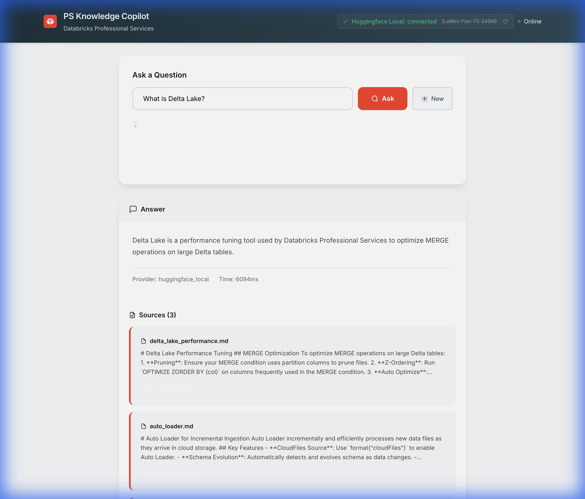
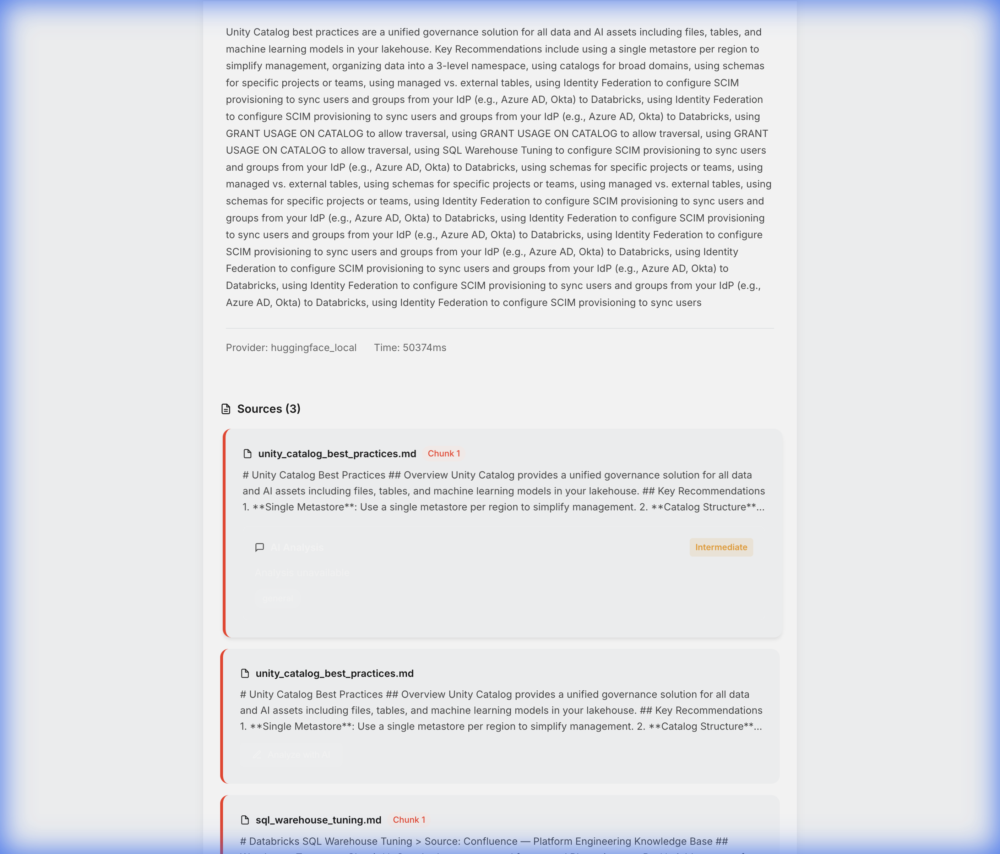
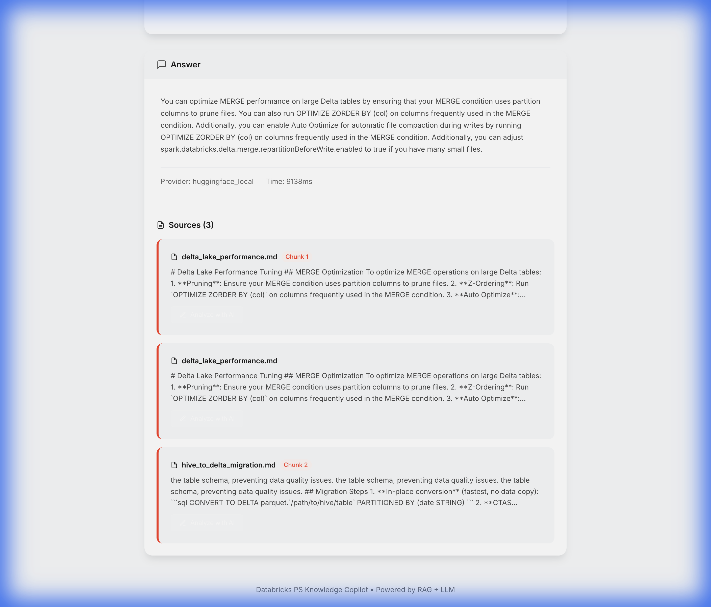

# 🧠 Databricks PS Knowledge Copilot

An internal AI "Knowledge Assistant" for Databricks Professional Services (PS) teams. This tool ingests technical documentation and provides instant, accurate answers to complex consulting questions using Retrieval-Augmented Generation (RAG).

## 📸 Screenshots

### Main Interface
The clean, modern interface features a consolidated AI connection status pill in the header showing the active LLM provider (Huggingface Local / LaMini-Flan-T5-248M), a search input, and quick-action example questions to get started instantly.


---

### Smart Query with RAG-Powered Answers
Ask any question and receive AI-generated answers grounded in your knowledge base. Answers are rendered with full markdown formatting, and the system retrieves the most relevant source chunks with relevance scores.



---

### AI Document Analysis
Click "Analyze with AI" on any retrieved source to get an instant summary, relevant topic tags, and a complexity rating (beginner/intermediate/advanced) — helping you quickly assess document relevance without reading the full text.



---

### Full Interface with Source Citations
The complete view shows AI-powered answers with intelligent source citations from 12 enterprise knowledge docs (Slack threads, Google Drive, Confluence, email digests), each linked to their original chunk and source file.



## 🚀 Features

### Core Functionality
-   **RAG Architecture**: Retrieves relevant context from ingested docs before answering.
-   **Local AI**: Uses a free, local Hugging Face model (`LaMini-Flan-T5`) for privacy and cost-efficiency.
-   **Vector Search**: Powered by ChromaDB (local) or Databricks Vector Search (cloud).
-   **Modern React UI**: Clean, responsive interface with real-time status indicators and example queries.
-   **FastAPI Backend**: High-performance async API with automatic documentation.
-   **Source Citations**: Every answer includes references to the source documents with relevance scores.

### 🆕 New AI-Powered Features
-   **💬 Smart Follow-up Questions**: AI automatically generates 3 contextual follow-up questions after each query
-   **📝 AI Document Analysis**: Click "Analyze with AI" on any source to get:
    - Concise 2-3 sentence summaries
    - Relevant topic tags
    - Complexity rating (beginner/intermediate/advanced)
-   **🔌 AI Connection Status**: Real-time monitoring of LLM provider health with visual indicators
-   **🎯 Interactive Question Chips**: Click any follow-up question to instantly trigger a new query

### 🔒 Security & Best Practices
-   **Input Validation**: Max length limits (500 chars for queries, 5000 for analysis)
-   **Rate Limiting**: 20 requests/min for queries, 10/min for analysis to prevent abuse
-   **Security Headers**: X-Frame-Options, X-Content-Type-Options, XSS Protection
-   **Strict CORS**: Limited to specific origins, methods, and headers
-   **Dependency Pinning**: All package versions locked for reproducible builds

## 🛠️ Tech Stack

-   **Backend**: Python 3.11+ with FastAPI
-   **Frontend**: React 18 + Vite
-   **LLM**: Hugging Face (`MBZUAI/LaMini-Flan-T5-248M`)
-   **Vector Store**: ChromaDB
-   **Embeddings**: Sentence Transformers (`all-MiniLM-L6-v2`)

## 📦 Setup

1.  **Clone the repository**:
    ```bash
    git clone <repo-url>
    cd Databricks-PS-Knowledge-Copilot
    ```

2.  **Create Virtual Environment & Install Backend Dependencies**:
    ```bash
    python3 -m venv venv
    source venv/bin/activate
    pip install -r requirements.txt
    ```

3.  **Configure Environment** (Optional):
    ```bash
    # Copy environment example
    cp .env.example .env
    
    # Edit .env to add API keys (optional - local model works without keys)
    # HUGGINGFACE_API_KEY=your_key_here
    # OPENAI_API_KEY=your_key_here (optional)
    ```

4.  **Install Frontend Dependencies**:
    ```bash
    cd frontend
    npm install
    cd ..
    ```

5.  **Run the Backend** (Terminal 1):
    ```bash
    source venv/bin/activate
    uvicorn app.api.main:app --reload --port 8000
    ```
    
    The API will be available at `http://localhost:8000` with docs at `http://localhost:8000/api/docs`.

6.  **Run the Frontend** (Terminal 2):
    ```bash
    cd frontend
    npm run dev
    ```
    
    The app will open at `http://localhost:5173`.

## 👥 How Databricks PS Consultants Use This

This tool is designed to reduce "tribal knowledge" loss and speed up delivery.

### 1. The Data Engineer 🛠️
**Scenario**: Optimizing a slow ETL pipeline.
-   **Query**: *"How do I optimize MERGE performance?"*
-   **Result**: The Copilot suggests Z-Ordering, pruning, and Auto Optimize, citing `delta_lake_performance.md`.
-   **Benefit**: Saves hours of searching through Slack or Wiki.

### 2. The Solution Architect 🏗️
**Scenario**: Designing a governance model for a large enterprise.
-   **Query**: *"What is the best way to structure Unity Catalog?"*
-   **Result**: Recommends the 3-level namespace (`catalog.schema.table`) and segregating environments by catalog.
-   **Benefit**: Ensures architectural consistency across engagements.

### 3. The Platform Admin 🔐
**Scenario**: Planning capacity and compute types.
-   **Query**: *"When should I recommend Photon?"*
-   **Result**: Advises using Photon for BI and heavy aggregations, citing `photon_engine.md`.
-   **Benefit**: Provides authoritative, documented backing for recommendations.

## 🔄 Ingestion Workflow

To add new knowledge:
1.  Place `.md`, `.txt`, or `.ipynb` files in `data/example_inputs/`.
2.  Use the API endpoint to trigger ingestion:
    ```bash
    curl -X POST http://localhost:8000/api/ingest \
      -H "Content-Type: application/json" \
      -d '{"directory": "data/example_inputs"}'
    ```
3.  The system automatically chunks, embeds, and indexes the new content.

> **Tip**: Check `http://localhost:8000/api/stats` to see the current document count in the knowledge base.

## 🔐 Security

This project implements enterprise-grade security practices:

- **API Rate Limiting**: Prevents abuse with configurable limits per endpoint
- **Input Validation**: Automatic validation of all user inputs with Pydantic
- **Security Headers**: OWASP-recommended headers to prevent common web vulnerabilities
- **CORS Protection**: Strict cross-origin policies for production deployments
- **Environment Isolation**: Sensitive credentials via environment variables only

> ⚠️ **Important**: Never commit `.env` files. Always rotate API keys if accidentally exposed.

## 📚 API Endpoints

### Core Endpoints
- `POST /api/query` - Ask a question (rate limit: 20/min)
- `POST /api/analyze` - Analyze document text (rate limit: 10/min)  
- `GET /api/ai-status` - Check LLM connection status
- `POST /api/ingest` - Add documents to knowledge base
- `GET /api/health` - System health check
- `GET /api/stats` - Knowledge base statistics

Full API documentation available at `http://localhost:8000/api/docs`

## 🧪 Testing

Run the test suite:
```bash
source venv/bin/activate
python tests/test_llm_features.py
```

## 📝 License

Internal tool for Databricks Professional Services teams.
